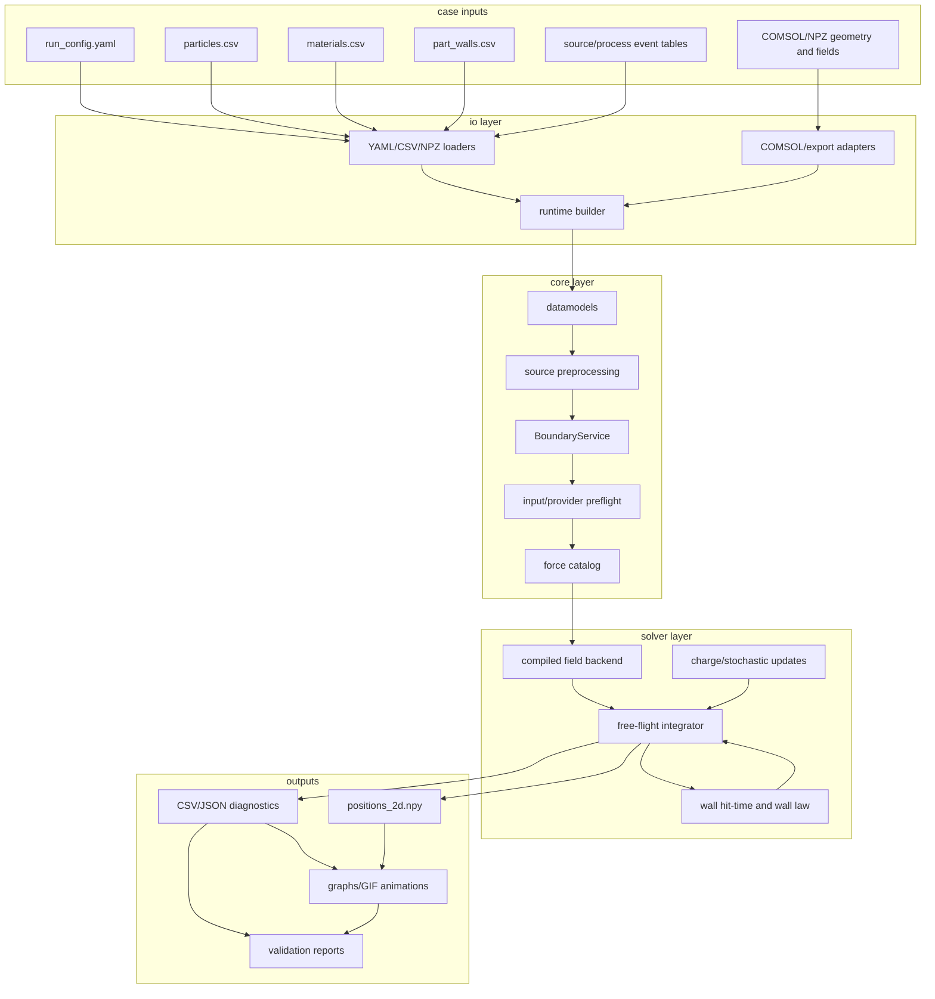
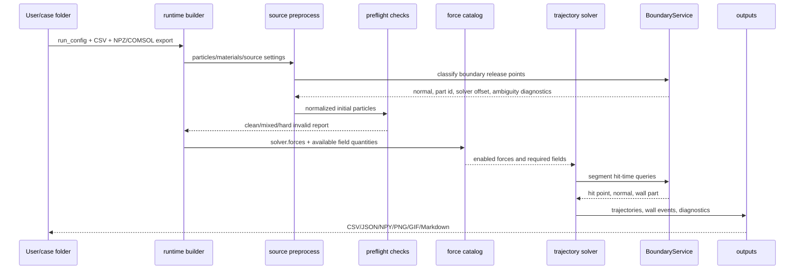
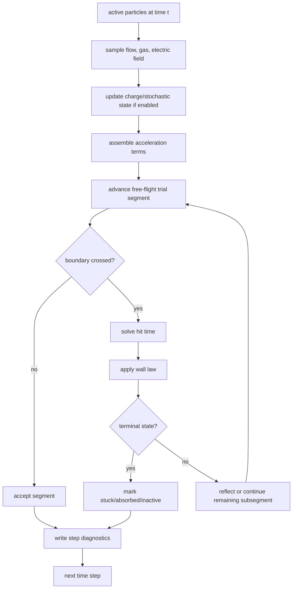
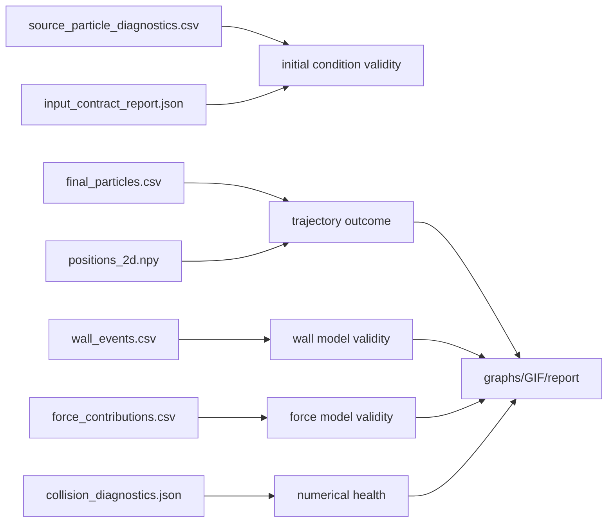
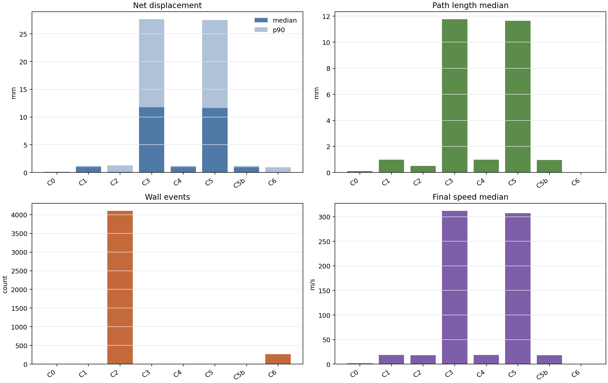
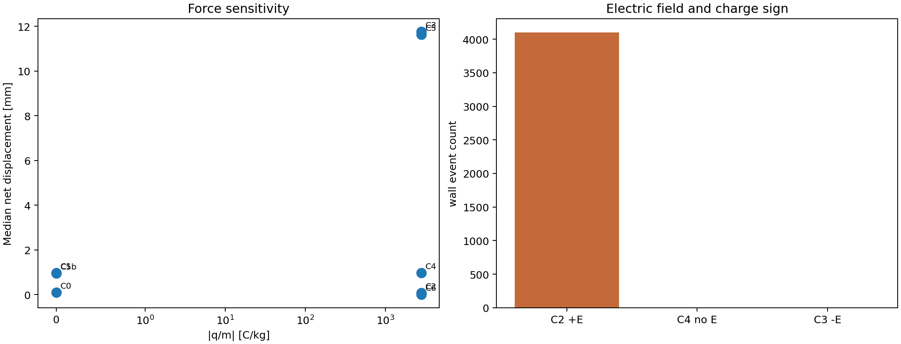
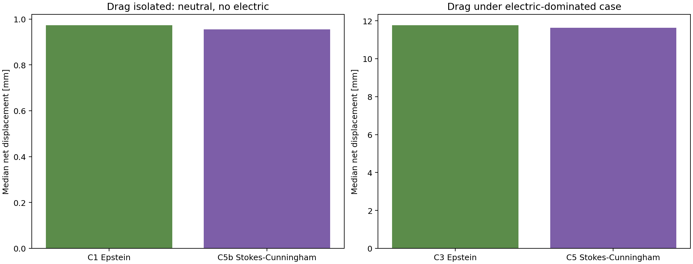
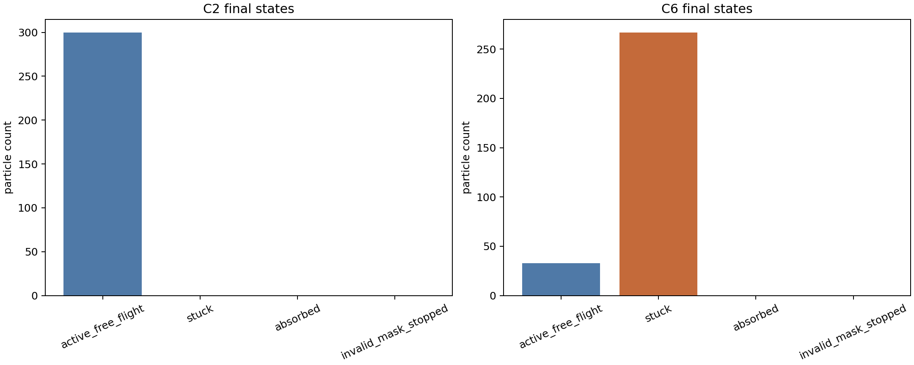

# チャンバー内表面起源粒子の軌道計算モデル説明書

## 1. 目的と位置づけ

本コードは、チャンバー内に放出された粒子の軌道を、与えられた流体場・電場・壁条件のもとで追跡するための計算ツールである。対象は、部品表面の膜破損、デポ剥離、再飛散などによって「すでに粒子として放出された後」の運動であり、剥離や破損が発生する確率そのものは解かない。

計算の考え方は、連続場として解かれた流体・電磁場の中を、個々の粒子が運動する Euler-Lagrange 型の粒子追跡である。COMSOL Particle Tracing Module でも、離散粒子の軌道を既存の流体場や電磁場と組み合わせて追跡し、drag、electric、thermophoretic、dielectrophoretic、lift などの力を組み合わせる考え方が使われる[^comsol-overview]。本コードも同じ設計思想に近く、場は外部から与え、粒子側を一方向結合で追跡する。

この文書は、コード実装の詳細を読む前に、モデルの範囲、入力、境界処理、数値計算、検証結果、計算速度、今後の改良点を確認するための技術説明書である。

## 2. 現在のコードの概要

| 項目 | 内容 |
|---|---|
| 主目的 | 与えられた粒子初期条件と場から、粒子位置・速度・壁接触・終端状態を計算する |
| 主な入力 | `run_config.yaml`, 粒子CSV, material CSV, wall CSV, COMSOL/NPZ由来の幾何・場 |
| 主な出力 | 粒子軌道、最終粒子状態、壁イベント、force contribution、preflight report、図、GIF |
| 空間次元 | 2D/3Dに対応。ただし今回のICP検証は2D |
| 場の扱い | 流速、電場、温度、密度、勾配などを外部場として与える |
| 粒子の扱い | point particle。粒子中心位置で場と境界を評価する |
| 結合 | 基本は one-way coupling。粒子が流体場・電場を変える二方向結合は行わない |
| COMSOLとの関係 | `.mph` を直接読まず、COMSOLからエクスポートしたCSV/NPZ/YAMLを入力として使う |

計算対象として自然なのは、以下のような問題である。

- 部品表面から放出された粒子が、流れや電場によってどこへ移動するか。
- 粒子径、密度、電荷、初速を変えると、飛散距離や壁接触がどう変わるか。
- wall law を反射、stick、disappear などに変えたとき、終端状態がどう変わるか。
- COMSOLで作成した場を使い、独立した粒子追跡コードとして挙動を確認する。

逆に、以下は本コードだけでは決まらない。

- どの部品がいつ破損するか。
- デポ膜がどの確率で剥離するか。
- 粒子電荷分布、sheath電場、ion drag が未入力の状態で自動的に決まるか。
- 実機の付着率、再飛散率、汚染量を無校正で予測できるか。

## 3. 機能一覧と全体ワークフロー

### 3.1 アーキテクチャ全体像

本コードは、単一の大きなsolverではなく、入力、正規化、preflight、force catalog、数値積分、壁処理、出力診断を分けて構成している。設計上の中心は、外部データを読み込んで `PreparedRuntime` 相当の実行可能な状態へ正規化し、solverがその状態だけを見て軌道計算することである。

各層の責務は次の通りである。

| 層 | 主な役割 | 第三者が確認すべき点 |
|---|---|---|
| case inputs | 粒子、場、壁条件、計算時間、出力設定を与える | 粒子径、電荷、初速、壁条件が意図通りか |
| io layer | 外部形式を内部データへ変換する | 単位、座標系、COMSOL export名の対応 |
| core layer | 境界、source、preflight、force catalogを整理する | 初期粒子が有効領域にあり、必要な場が揃っているか |
| solver layer | 軌道、力、壁衝突、電荷更新を時間積分する | 力のON/OFF、壁イベント、invalid stopの有無 |
| outputs | 診断、軌道、図、GIF、検証表を出す | 結果の再現性と説明可能性 |

### 3.2 実行時ワークフロー

1回の計算では、次の順に処理する。

この順序の意味は、solver loopの中で入力の曖昧さを都度補正しないことである。境界上releaseの扱い、場の有効性、forceの有効化条件は、軌道計算前に明示的に診断する。これにより、粒子が飛ばない、壁で止まる、電場が効かない、といった結果を、入力条件、境界条件、力モデル、数値停止のどこに起因するか追いやすくなる。

### 3.3 機能区分

| 区分 | 機能 | 説明 | 主な成果物 |
|---|---|---|---|
| case assembly | YAML/CSV/NPZ読み込み | 計算条件、粒子表、材料表、壁表、場を読み込む | prepared runtime |
| COMSOL/export | 外部場取り込み | `.mph` ではなくエクスポート済みデータを入力にする | geometry/field provider |
| source model | 初期粒子設定 | 表面法線方向速度、粒径、電荷、source eventを整理 | resolved particles |
| boundary release | 境界上初期化 | 壁上粒子を計算領域側へ最小正規化する | source diagnostics |
| preflight | 入力健全性確認 | field support、boundary support、force必要場を確認 | input/provider reports |
| force catalog | 力の有効化管理 | drag/electric/Brownian/thermophoresis/DEP/lift等を整理 | model input summary |
| field backend | 場の補間高速化 | 流速、電場、温度、勾配を時間・空間補間する | compiled backend |
| integration | 軌道積分 | ETD/ETD2等でdrag緩和込みの運動を進める | positions, final state |
| collision | 壁イベント | hit-timeを求めwall lawを適用する | wall_events.csv |
| reporting | 結果整理 | force contribution、summary、図、GIFを出す | CSV/JSON/PNG/GIF |

### 3.4 solver内部の流れ

solver内部で重要なのは、壁との交差を単なる「ステップ終点の位置」で処理しない点である。粒子が1ステップ内で壁を横切る場合、hit-timeを求め、その時刻の粒子位置と速度にwall lawを適用する。これにより、高速粒子や壁近傍粒子でも、壁イベントの時刻と位置を診断しやすい。

### 3.5 出力と妥当性確認の関係

結果を見るときは、軌道図だけで判断しない。初期条件が正しく置かれているか、力が有効になっているか、壁イベントが自然か、数値停止がないかを別々の診断ファイルで確認する。ICP validation suiteのC0-C6は、この確認順序に沿って作った対照ケースである。

## 4. モデル説明

### 4.1 基本の運動方程式

粒子位置を $\mathbf{x}$、粒子速度を $\mathbf{v}$、流体速度を $\mathbf{u}(\mathbf{x},t)$ とすると、基本形は次のように書ける。

$$
\frac{d\mathbf{x}}{dt} = \mathbf{v}
$$

$$
\frac{d\mathbf{v}}{dt}
= \frac{\mathbf{u}(\mathbf{x},t)-\mathbf{v}}{\tau_{\mathrm{eff}}}
+ \frac{q}{m_p}\mathbf{E}(\mathbf{x},t)
+ \mathbf{a}_{\mathrm{body}}
+ \mathbf{a}_{\mathrm{optional}}
+ \mathbf{a}_{\mathrm{stochastic}}
$$

ここで、$\tau_{\mathrm{eff}}$ はdragモデルから決まる有効緩和時間、$q$ は粒子電荷、$m_p$ は粒子質量、$\mathbf{E}$ は電場である。`optional` には熱泳動、dielectrophoresis、lift、pressure-gradient、virtual-mass などの項が入る。

球形粒子を仮定すると、粒子質量は

$$
m_p = \rho_p \frac{\pi d_p^3}{6}
$$

である。今回のICP検証では、$d_p=10\,\mathrm{nm}$、$\rho_p=2200\,\mathrm{kg/m^3}$ を用いている。電荷が $\pm 20e$ の場合、

$$
\frac{q}{m_p} \simeq \pm 2.78\times 10^3\,\mathrm{C/kg}
$$

となり、10 nm粒子では電気力が軌道に強く効き得る。

### 4.2 dragモデル

dragは、粒子速度が流体速度へ緩和する効果として扱う。低速・連続流のStokes緩和時間は概念的に

$$
\tau_p = \frac{\rho_p d_p^2}{18\mu}
$$

で表せる。ただし、微粒子や低圧ガスでは連続流仮定が崩れ、Knudsen数

$$
\mathrm{Kn} = \frac{\lambda}{d_p}
$$

を見て希薄気体補正を考える必要がある。COMSOLのParticle Tracing for Fluid Flowでも、slip flow、transition、free molecular regimeに対してdragやthermophoresisの希薄化補正を扱う説明がある[^comsol-fluid-flow]。COMSOLのrarefied drag資料では、Cunningham-Millikan-Davies、Basset、Epstein、Phillips などの補正が整理され、Epsteinモデルは大きなKnudsen数側の漸近モデルと説明されている[^comsol-rarefied-drag]。

本コードの代表的なdrag設定は次の通りである。

| drag model | 主な用途 | 注意点 |
|---|---|---|
| `stokes` | 連続流・低Reの基準モデル | 希薄気体補正なし |
| `stokes_cunningham` | slip補正を含むStokes系モデル | 低圧・微粒子でStokesより自然な場合がある |
| `schiller_naumann` | 有限Re補正 | 粒子Re数が無視できない場合に使う |
| `epstein` | free molecular側、低圧・微粒子 | ICPの10 nm粒子検証では主代表として使用 |

### 4.3 電気力と電荷

電気力は、粒子電荷と電場から

$$
\mathbf{a}_E = \frac{q}{m_p}\mathbf{E}
$$

として入る。正電荷と負電荷では加速度の向きが反転する。プロセスプラズマでは、微粒子が負帯電し、sheath境界付近に捕捉される観察が報告されている[^ibm-particles]。またICPエッチングでは、負帯電粒子や負イオンに対して、電気力とion dragが競合し、sheath edge付近で力が釣り合う状況が議論されている[^collison-kushner]。

本コードでは、電場は外部場として与える。電場が与えられていない場合、電気力は発生しない。電荷は粒子CSVなどで固定値として与えることも、2D regular field上で簡易的に時間更新することもできる。重要なのは、プラズマのPoisson方程式、電子・イオンの連続方程式、sheath構造そのものは本コード内では解かない点である。

#### 4.3.1 COMSOLでプラズマ計算がある場合

COMSOL側でPlasma ModuleやElectric Currents等により電位、電場、電子温度、電子密度、イオン密度を計算している場合は、それらを場としてエクスポートして使う。一般に電位 $\phi$ がある場合、電場は

$$
\mathbf{E} = -\nabla \phi
$$

である。本コードは、COMSOLから直接エクスポートされた $E_x,E_y,E_z$、または電場として変換済みの場を読み、粒子ごとに

$$
\mathbf{F}_E = q_p \mathbf{E}, \qquad
\mathbf{a}_E = \frac{q_p}{m_p}\mathbf{E}
$$

を評価する。COMSOL側で粒子電荷まで計算している場合は、その電荷を固定値または時系列値として粒子入力へ渡すのが最も明確である。COMSOL側で電子温度や密度だけを計算している場合は、本コードのcharge modelを使い、エクスポートされた $T_e,n_e,n_i,T_i$ から粒子電荷を近似更新できる。

この場合の役割分担は次のようになる。

| 項目 | COMSOL側 | 本コード側 |
|---|---|---|
| プラズマ場 | $\phi$, $\mathbf{E}$, $T_e$, $n_e$, $n_i$ 等を計算 | エクスポート済み場として補間 |
| 粒子電荷 | COMSOLで計算済みなら入力値として渡す | $q_p/m_p$ を計算し電気力へ反映 |
| 軌道 | COMSOLでも計算可能 | 独立solverとして比較・大量ケース展開 |
| sheath/ion drag | COMSOL側モデルまたは別途解析 | 未入力なら推定しない |

#### 4.3.2 プラズマ計算がない場合

プラズマ計算がない場合は、電気力を使うかどうかを入力条件として決める必要がある。選択肢は大きく三つある。

| 方針 | 使う入力 | 式 | 使いどころ |
|---|---|---|---|
| 電気力OFF | `solver.forces.electric=false` | $\mathbf{a}_E=0$ | 流れ、drag、初速だけを見たい対照ケース |
| 固定電荷 + 外部電場 | 粒子の $q_p$ と $\mathbf{E}$ 場 | $\mathbf{a}_E=(q_p/m_p)\mathbf{E}$ | 符号や電場強度の感度検証 |
| 簡易プラズマ背景 + 動的電荷 | $T_e,n_e,n_i,T_i$ などのscalar/field | $dq/dt=(q_{\mathrm{eq}}-q)/\tau_q$ | COMSOL plasma計算は無いが、帯電時定数を見たい場合 |

固定電荷モデルでは、粒子電荷をユーザーが与える。例えば粒子径 $d_p$、密度 $\rho_p$、電荷数 $Z_p$ の粒子では、

$$
q_p = Z_p e,\qquad
m_p = \rho_p \frac{\pi d_p^3}{6}
$$

であり、

$$
\frac{q_p}{m_p}
= \frac{6 Z_p e}{\rho_p \pi d_p^3}
$$

となる。今回の検証条件 $d_p=10\,\mathrm{nm}$, $\rho_p=2200\,\mathrm{kg/m^3}$, $Z_p=\pm20$ では、$q_p/m_p \simeq \pm2.78\times10^3\,\mathrm{C/kg}$ である。

#### 4.3.3 本コードの動的電荷モデル

動的電荷モデルを有効にした場合、本コードは粒子電荷を

$$
\frac{dq}{dt} = \frac{q_{\mathrm{eq}} - q}{\tau_q}
$$

の緩和形で更新する。時間刻み $\Delta t$ に対しては、

$$
q(t+\Delta t)
= q_{\mathrm{eq}}
+ \left[q(t)-q_{\mathrm{eq}}\right]\exp\left(-\frac{\Delta t}{\tau_q}\right)
$$

を使う。実装上のmodeは主に次の二つである。

| mode | 必要な入力 | 概要 |
|---|---|---|
| `te_relaxation` | $T_e$ | 浮遊電位を $\phi_f=-\alpha T_e$ と置き、$q_{\mathrm{eq}}=C_p\phi_f$ へ緩和 |
| `density_temperature_flux_relaxation` / `finite_rate_flux_balance` | $T_e,n_e,n_i,T_i$ | 電子・イオンflux balanceから $\phi_f$ を解き、$q_{\mathrm{eq}}=C_p\phi_f$ へ緩和 |

粒子を孤立球とみなすと静電容量は

$$
C_p = 4\pi\epsilon_0 a_p
$$

である。`te_relaxation` では、

$$
\phi_f = -\alpha T_e,\qquad
q_{\mathrm{eq}} = C_p\phi_f
$$

とする。ここで $T_e$ はeV単位なら電位[V]と同じ数値スケールで扱える。既定の $\alpha$ は経験的な浮遊電位係数で、電子温度に対して負の浮遊電位を与える。

flux balance型では、電子fluxとイオンfluxの釣り合いを解く。実装では概念的に、

$$
\Gamma_e
= s_e n_e
\sqrt{\frac{eT_e}{2\pi m_e}}
\exp\left(\frac{\phi}{T_e}\right)
$$

$$
\Gamma_i
= s_i Z_i n_i v_i
\max\left(1-\frac{Z_i\phi}{T_i},\,0\right)
$$

とし、

$$
\Gamma_i-\Gamma_e=0
$$

をNewton反復で解く。イオン速度 $v_i$ は、thermal、Bohm、または両者の大きい方から選ぶ。得られた $\phi_f$ から

$$
q_{\mathrm{eq}} = 4\pi\epsilon_0 a_p \phi_f
$$

を計算する。Debye長も診断として計算し、

$$
\lambda_D
= \left[
\frac{e}{\epsilon_0}
\left(
\frac{n_e}{T_e}
+ \frac{Z_i^2 n_i}{T_i}
\right)
\right]^{-1/2}
$$

の形で評価する。ここでも $T_e,T_i$ はeV表記で扱う。

現在のcharge modelは、2D regular rectilinear fieldまたはscalarなplasma backgroundを主対象にしている。3D場、三角形メッシュ場、sheath内の非局所な帯電、secondary emission、photoemission、ion wakeまでは内蔵していない。

#### 4.3.4 ICP検証で採用した想定

今回のICP validation suiteでは、プラズマ場そのものを本コードで解かず、COMSOL由来の2D場を既知場として使った。粒子は直径 `10 nm`、密度 `2200 kg/m3`、Epstein dragを代表条件とした。電荷は固定電荷とし、代表的な負帯電ケースとして `-20e`、符号検証ケースとして `+20e` を置いた。

採用した想定は次の通りである。

| 項目 | 想定 |
|---|---|
| プラズマ場 | COMSOL由来の外部場として与える |
| 粒子電荷 | 固定電荷。動的帯電は今回OFF |
| 代表電荷 | 低温ICPの微粒子代表は負電荷側、符号検証として正電荷も実行 |
| drag | 低圧・10 nm粒子を想定し、Epsteinを主代表にする |
| ion drag | 今回は未入力。必要なら外部forceまたは場として追加する |
| sheath詳細 | COMSOL場に含まれる範囲だけ反映。本コード側ではsheathを再構成しない |
| 粒子発生 | 剥離・破損確率は解かず、表面上の初期粒子として与える |

### 4.4 Brownian/stochastic、熱泳動、DEP、lift等

COMSOLの説明でも、粒子が小さい場合にはBrownian motionが重要になり得ること、またdrag以外にlift、electric、magnetic、thermophoretic、acoustic radiationなどの力を組み合わせられることが示されている[^comsol-overview]。本コードも、必要な場が存在する場合に以下の力を扱う設計になっている。

#### 4.4.1 力モデル一覧

| 力 | 主な式 | 必要な入力 | 実装上の位置づけ |
|---|---|---|---|
| gravity/body force | $\mathbf{a}_g=\mathbf{g}$ または $(1-\rho_g/\rho_p)\mathbf{g}$ | body acceleration, $\rho_g,\rho_p$ | 定数加速度。buoyancyは任意 |
| Brownian/stochastic | $\langle \Delta x_i\Delta x_j\rangle=2D\Delta t\,\delta_{ij}$ | $T,\mu,d_p$, random seed | 小粒子の拡散的揺らぎ。今回OFF |
| thermophoresis | $\mathbf{a}_{th}\propto -\nabla T$ | $T,\nabla T,\mu,\rho_g,k_g,k_p$ | Talbot型係数またはcontinuum近似 |
| dielectrophoresis | $\mathbf{F}_{DEP}=2\pi\epsilon_m a^3\mathrm{Re}(K)\nabla\lvert\mathbf{E}\rvert^2$ | $\mathbf{E}$, $\nabla\lvert\mathbf{E}\rvert^2$, 誘電率 | DC/AC Clausius-Mossotti |
| lift | Saffman型 $\mathbf{F}_L\propto \mu a^2(\mathbf{v}-\mathbf{u})\times\boldsymbol{\omega}/\sqrt{\nu\lvert\omega\rvert}$ | 流速、vorticity、$\mu,\rho_g$ | せん断流中の横力 |
| pressure-gradient | $\mathbf{a}_{pg}=(\rho_g/\rho_p)D\mathbf{u}/Dt$ | 流体加速度または速度場 | COMSOL parity対象 |
| virtual mass | $\mathbf{a}_{vm}=C_{vm}(\rho_g/\rho_p)(D\mathbf{u}/Dt \text{ along particle})$ | 速度勾配、時間微分、$\rho_g,\rho_p$ | added mass近似 |

#### 4.4.2 Brownian/stochastic

Brownian motionは、粒子が十分小さく、熱揺らぎが軌道に効く場合に使う。拡散係数はStokes-Einstein型に[^einstein-brownian]

$$
D = \frac{k_B T}{3\pi\mu d_p}
$$

と書ける。位置のランダム変位で表すなら、

$$
\Delta \mathbf{x}_{B}
= \sqrt{2D\Delta t}\,\boldsymbol{\xi}
$$

であり、$\boldsymbol{\xi}$ は平均0、分散1の独立な正規乱数である。慣性を含む速度式では、Langevin型に

$$
d\mathbf{v}
= -\frac{\mathbf{v}-\mathbf{u}}{\tau_p}dt
+ \sqrt{\frac{2k_BT}{m_p\tau_p}}\,d\mathbf{W}
$$

のように書ける。本コードではstochastic設定と乱数seedを明示した場合に使う。今回のICP検証では、電場・初速・壁条件の切り分けを優先するためOFFにした。

#### 4.4.3 熱泳動

熱泳動は温度勾配によって粒子が移動する効果であり、概念的には高温側から低温側へ向かう力として[^talbot-thermophoresis]

$$
\mathbf{a}_{th} = -C_{th}\nabla T
$$

の形で入る。本コードでは、温度場から $\nabla T$ を作り、Talbot型の係数を使ってKnudsen数、気体熱伝導率、粒子熱伝導率の効果を含める。実装上は、

$$
Kn = \frac{\lambda}{a_p}
$$

$$
C_{th}
\sim
\frac{\mu}{\rho_g T \tau_p}
\frac{
C_s(k_g/k_p+C_tKn)
}{
(1+3C_mKn)(1+2k_g/k_p+2C_tKn)
}
$$

に相当する係数を用い、$\mathbf{a}_{th}=-C_{th}\nabla T$ として加える。`continuum` modelでは $Kn$ の寄与を0として扱う。

#### 4.4.4 Dielectrophoresis

dielectrophoresisは、粒子が中性でも、非一様電場中で分極によって受ける力である。球形粒子の代表式は[^dep-clausius]

$$
\mathbf{F}_{DEP}
= 2\pi\epsilon_0\epsilon_m a_p^3
\mathrm{Re}\left[K(\omega)\right]
\nabla \lvert\mathbf{E}\rvert^2
$$

である。Clausius-Mossotti因子は、DC近似では

$$
K
= \frac{\epsilon_p-\epsilon_m}{\epsilon_p+2\epsilon_m}
$$

と書ける。ACの場合は複素誘電率

$$
\epsilon^*=\epsilon - j\frac{\sigma}{\omega}
$$

を使い、

$$
K(\omega)
= \frac{\epsilon_p^*-\epsilon_m^*}{\epsilon_p^*+2\epsilon_m^*}
$$

の実部を使う。本コードでは、$\nabla\lvert\mathbf{E}\rvert^2$ と粒子・媒質の誘電率、導電率、周波数を入力として加速度へ変換する。

#### 4.4.5 Lift

せん断流中で、粒子と流体の相対速度があり、周囲流れに渦度がある場合、横方向のliftが発生する。Saffman型の低Re近似は、概念的には[^saffman-lift]

$$
\mathbf{F}_L
\propto
\mu a_p^2
\frac{(\mathbf{v}-\mathbf{u})\times\boldsymbol{\omega}}
\sqrt{\nu\lvert\boldsymbol{\omega}\rvert}}
$$

である。ここで $\nu=\mu/\rho_g$、$\boldsymbol{\omega}=\nabla\times\mathbf{u}$ である。本コードでは、速度場からvorticityを得て、slip速度と組み合わせて横加速度として加える。

#### 4.4.6 Pressure-gradient と virtual mass

流体加速度が大きい場合、粒子はdragだけでなく流体の非定常運動にも影響される。Maxey-Riley型の粒子運動式では、pressure-gradientやadded massが現れる[^maxey-riley]。簡略化して書くと、

$$
\mathbf{a}_{pg}
= \frac{\rho_g}{\rho_p}
\frac{D\mathbf{u}}{Dt}
$$

である。virtual massは、粒子が周囲流体を押しのけて加速する効果で、

$$
\mathbf{a}_{vm}
= C_{vm}\frac{\rho_g}{\rho_p}
\left[
\frac{D\mathbf{u}}{Dt}\bigg|_{\mathbf{x}_p}
\text{particle-path correction}
\right]
$$

の形で入る。本コードでは、pressure-gradientは流体材料加速度または速度場から作った流体加速度を使い、virtual massは係数 $C_{vm}$ と密度比を使って加える。COMSOL Particle Tracingのpressure-gradient/virtual mass forceとの比較対象として扱える。

#### 4.4.7 今回のICP検証で使った力

今回のICP validation suiteでは、意図的に力を絞った。

| Case群 | 有効化した力 | 目的 |
|---|---|---|
| C0/C1/C4/C5b | dragのみ | 初期条件とdragの基準応答を見る |
| C2/C3/C5/C6 | drag + electric | 電場ON/OFF、電荷符号、壁条件の切り分け |
| 全ケース | Brownian, thermophoresis, DEP, lift, pressure-gradient, virtual-massはOFF | まず基本の軌道、電気力、境界処理を検証する |

これにより、結果の解釈を「どの力が効いたか」ではなく、「設定した力が本当に結果へ反映されたか」に絞れる。

### 4.5 初期条件と表面release

チャンバー部品由来の粒子は、初期位置が壁上または壁のごく近傍になる。これをそのまま場補間へ渡すと、メッシュやvalid maskの都合で「境界外」と判定されることがある。そこで通常runでは、`source.preprocess.boundary_release` により、明示境界を参照して粒子を計算領域側へ最小限だけ移動する。

この処理は、物理的な剥離距離を仮定するものではない。目的は、表面上に置かれた粒子を軌道計算の初期点として定義することである。COMSOLでも、boundaryやinletから粒子をreleaseし、初期速度を指定する操作が用意されている[^comsol-inlet]。本コードのboundary releaseは、それに近い「境界由来の初期粒子を計算領域側に置く」ための前処理である。

### 4.6 壁モデル

壁に衝突した粒子は、衝突時刻の位置・速度に基づいてwall lawを適用する。COMSOLの粒子追跡でも、壁条件としてBounce、Freeze、Stick、Disappear、Pass through、Diffuse scattering、Mixed diffuse/specularなどが用意され、Diffuse scatteringではKnudsenのcosine lawに基づく反射方向が使われる[^comsol-wall]。

本コードで重要なのは、粒子がステップ終端で壁にめり込んだ後に処理するのではなく、時間ステップ内のhit-timeを求め、その時点の状態で壁条件を適用する点である。

| wall law | 意味 | 代表的な使い方 |
|---|---|---|
| specular/bounce | 鏡面反射 | 弾性的な反射傾向の確認 |
| stick/freeze | 壁到達で停止 | 再付着・捕捉の上限側評価 |
| disappear/absorb | 壁到達で消滅扱い | 排気・吸収境界の近似 |
| diffuse/mixed | 確率的な散乱 | 表面粗さや熱的再放出の近似 |

### 4.7 数値積分

時間積分では、drag緩和を含む粒子運動を有限の時間刻みで進める。公開設定として `drag_relaxation`、`etd`、`etd2` があり、ICP検証では `etd2` を使った。`etd2` はdrag緩和を含む項を扱いやすくするための2次の指数時間差分型の経路で、強いdrag緩和を陽的Eulerだけで扱うより安定性を取りやすい。

今回の代表ケースでは、

$$
\Delta t = 20\,\mathrm{ns},\quad t_{\mathrm{end}} = 50\,\mu\mathrm{s}
$$

であり、名目上の積分ステップ数は

$$
N_{\mathrm{step}} = \frac{t_{\mathrm{end}}}{\Delta t} = 2500
$$

である。保存間隔は `save_every=50` なので、可視化用の保存フレームは約51枚になる。

## 5. 妥当性検証

ICP validation suiteでは、COMSOL由来の2D場を使い、表面上に置いた300個の粒子を追跡した。詳細は [ICP表面起源粒子の妥当性確認](icp_validation_third_party_report.md) にまとめている。

### 5.1 検証ケース

| Case | 目的 | 主な条件 |
|---|---|---|
| C0 | 表面releaseと初期field support | 中立、低初速、電場OFF |
| C1 | 初速のみで飛散できるか | 中立、20 m/s、電場OFF |
| C2 | 正電荷で電場が働くか | `+20e`, 電場ON |
| C3 | 負電荷で逆向き傾向が出るか | `-20e`, 電場ON |
| C4 | C2の差が電場由来か | `+20e`, 電場OFF |
| C5 | dragモデル感度 | C3をStokes-Cunninghamへ変更 |
| C5b | drag単独対照 | 中立、Stokes-Cunningham、電場OFF |
| C6 | wall law感度 | C2のwall lawをstickへ変更 |

### 5.2 主要な結果

| Case | Forces | Drag | Charge [e] | Net median [mm] | Path median [mm] | Wall events | Final state | Invalid/Hard |
|---|---|---|---:|---:|---:|---:|---|---:|
| C0 | drag | epstein | 0 | 0.0974 | 0.0974 | 0 | active_free_flight=300 | 0/0 |
| C1 | drag | epstein | 0 | 0.972 | 0.972 | 1 | active_free_flight=300 | 0/0 |
| C2 | drag,electric | epstein | 20 | 0.0816 | 0.507 | 4102 | active_free_flight=300 | 0/0 |
| C3 | drag,electric | epstein | -20 | 11.8 | 11.8 | 1 | active_free_flight=300 | 0/0 |
| C4 | drag | epstein | 20 | 0.972 | 0.972 | 1 | active_free_flight=300 | 0/0 |
| C5 | drag,electric | stokes_cunningham | -20 | 11.6 | 11.6 | 1 | active_free_flight=300 | 0/0 |
| C5b | drag | stokes_cunningham | 0 | 0.955 | 0.955 | 1 | active_free_flight=300 | 0/0 |
| C6 | drag,electric | epstein | 20 | 0.0041 | 0.0299 | 267 | active_free_flight=33, stuck=267 | 0/0 |

元データは [icp_validation_suite_metrics.csv](assets/icp_validation/icp_validation_suite_metrics.csv) と [icp_validation_suite_evaluation.json](assets/icp_validation/icp_validation_suite_evaluation.json) に保存している。

### 5.3 図による確認

全体比較では、C0からC6までの軌道量、壁イベント、最終速度をまとめている。C2は正電荷が電場で壁側へ戻されるため、path lengthに対してnet displacementが小さい。C3は負電荷で大きく飛散する。

電荷符号と電場ON/OFFの比較では、C2とC4により電場効果、C2とC3により電荷符号効果を分離できる。

dragモデル感度では、今回の条件では電気力や初速の寄与が大きく、EpsteinとStokes-Cunninghamの差は比較的小さい。ただし、dragモデルを変えても数値的な破綻が出ないことは確認できる。

wall law比較では、specular反射のC2とstickのC6を比較することで、壁到達が終端状態に変換されることを確認できる。

代表的なアニメーションは以下で確認できる。

- [C2 positive charge, electric field](assets/icp_validation/cases/C2/trajectories_all_particles.gif)
- [C3 negative charge, electric field](assets/icp_validation/cases/C3/trajectories_all_particles.gif)
- [C6 stick wall law](assets/icp_validation/cases/C6/trajectories_all_particles.gif)

### 5.4 検証から言えること

| 確認項目 | 判定 |
|---|---|
| 境界上初期粒子を計算領域側へ置けるか | 全ケースで300/300粒子にboundary release適用、offset失敗0 |
| 初速だけで飛散できるか | C0/C1で変位が約10倍に増加 |
| 電場ON/OFFが結果に出るか | C2/C4でwall eventsが1から4102へ変化 |
| 電荷符号が結果に出るか | C2/C3で飛散距離と壁イベントが大きく変化 |
| dragモデル変更で破綻しないか | C3/C5、C1/C5bで不正停止なし |
| wall lawが終端状態に反映されるか | C6で267個がstuck |
| 数値破綻がないか | C0-C5でhard invalid、invalid stop、unresolved crossingが0 |

この検証は「実機コンタミ量を直接予測した」ものではない。入力した粒子条件、場、壁条件に対して、計算経路が設定どおり動くことを確認したものである。

## 6. 計算速度

速度は、同一PC上で代表4ケースを再実行して測定した。シミュレーション本体と可視化を分けて測定している。

| 項目 | 条件 |
|---|---|
| 測定日時 | 2026-05-15 |
| OS | Microsoft Windows 11 Pro 10.0.26200 |
| CPU | Intel Core Ultra 7 265KF, 20 cores / 20 logical processors |
| Memory | 約63.6 GiB |
| Python | 3.13.12 |
| 粒子数 | 300 |
| 時間刻み | 20 ns |
| 終了時刻 | 50 us |
| 名目ステップ数 | 2500 |
| 可視化 | graphs + animations + boundary |

| Case | 特徴 | Wall events | Simulation [s] | Visualization [s] | Total [s] |
|---|---|---:|---:|---:|---:|
| C0 | 中立、低初速 | 0 | 7.279 | 68.715 | 75.994 |
| C2 | 正電荷、電場ON、反射多数 | 4102 | 40.846 | 76.432 | 117.278 |
| C3 | 負電荷、電場ON | 1 | 5.457 | 76.118 | 81.575 |
| C6 | 正電荷、stick wall | 267 | 5.356 | 76.703 | 82.059 |

C2のシミュレーション時間が長いのは、壁反射イベントが4102件と多く、時間ステップ内のhit-time処理と反射処理が増えるためである。一方、C3やC6は壁イベントが少ない、またはstickにより早く終端する粒子が多いため短い。

可視化時間はGIF生成が支配的であり、ケース間の差は小さい。大量ケースを処理する場合は、まずCSV/JSONだけで評価し、代表ケースだけGIF化する運用が現実的である。

## 7. 今後の改良ポイント

| 優先度 | 改良項目 | 理由 | 実装方針 |
|---|---|---|---|
| 高 | 速度ベンチマーク自動記録 | 性能劣化と壁イベント増加の影響を追いやすくする | 実行時summaryにwall time、粒子数、ステップ数、wall event数を記録 |
| 高 | sheath/ion dragの入力経路整理 | ICP粒子では電気力とion dragの釣り合いが重要 | solverが推定せず、外部場またはforce contributionとして入力可能にする |
| 高 | 近壁場・boundary release感度 | 2 um offsetは数値正規化であり、sheath直近では感度が出る | offset、valid mask、境界近傍場の感度ケースを標準化 |
| 中 | 動的帯電モデルの拡張 | 粒子電荷は時間・位置で変わり得る | plasma backgroundとfield providerの対応範囲を広げる |
| 中 | 近壁drag/lift補正 | 壁近傍では流体力が変わる場合がある | COMSOLや文献式に合わせ、明示的にON/OFFできるforceとして追加 |
| 中 | 3D charge/triangle mesh対応 | 実チャンバーは3D効果が大きい | 2Dで検証済みのcharge経路を3D providerへ拡張 |
| 中 | 実験・COMSOLとの再校正 | 絶対量の信頼性には比較データが必要 | wall-hit、飛散距離、到達分布を実験またはCOMSOLと比較 |
| 低 | レポート生成の自動化 | 手作業の図・表更新を減らす | metrics CSVからMarkdown表を生成 |

## 8. 専門知識と工数見積もり

ここでは、1人月をおおむね20人日、または4人週として換算する。見積もり対象は、研究用の一枚スクリプトではなく、第三者が入力、数値モデル、検証根拠、結果ファイルを追跡できる実務コードである。

### 8.1 現在の実装規模

本コードの実装規模は、粒子の運動方程式を解くsolver本体だけでは判断できない。COMSOL/外部場取り込み、境界処理、source前処理、force catalog、診断出力、可視化、検証テストが一体で意味を持つ。

| 区分 | Pythonファイル数 | 行数 | 主な内容 |
|---|---:|---:|---|
| `particle_tracer_unified` | 67 | 21,035 | runtime builder、field/backend、source、boundary、solver、force、output |
| `tests` | 27 | 8,970 | force、boundary、COMSOL faithful、runtime output、valid maskの回帰検証 |
| `tools` + `external` | 37 | 13,344 | 可視化、比較、case生成、外部データ処理 |
| 合計 | 131 | 43,349 | 実行、検証、可視化を含む一式 |

主要パッケージ内の内訳は次の通りである。

| モジュール | 行数 | 実装上の役割 |
|---|---:|---|
| `solvers` | 11,879 | 時間積分、free-flight、衝突、charge/stochastic更新、runtime出力 |
| `core` | 5,425 | boundary service、source処理、preflight、datamodel、force catalog |
| `io` | 1,495 | YAML/CSV/NPZ、COMSOL由来データ、manifest入出力 |
| `providers` | 1,092 | 外部場、geometry、field samplingの供給 |
| `solvers/forces` | 590 | force contribution、drag/electric/optional forceの実装要素 |
| `compare` | 504 | COMSOL/外部結果との比較補助 |

この規模から分かるように、開発の難所は「粒子を1ステップ進める式」よりも、場の単位・座標・補間、境界上初期条件、壁衝突、forceの有効化条件、診断の一貫性、検証ケースの維持にある。

### 8.2 理論調査から実装までに必要な作業

物理モデルの追加や検証では、式を実装する前に、どの入力場を必要とし、どの範囲で式が有効かを決める必要がある。特にチャンバー内コンタミ飛散では、実機条件、COMSOL場、粒子径、圧力、壁近傍距離、粒子電荷が結果を大きく変える。

| 領域 | 理論調査で決めること | 実装で必要なこと | 検証で必要なこと | 難しい点 |
|---|---|---|---|---|
| drag/希薄気体 | Stokes、Cunningham、Epsteinの適用Kn範囲 | drag model選択、緩和時間、単位診断 | 粒径・圧力・速度差の対照ケース | 低圧ICPでは連続体dragだけでは不十分 |
| 電荷・電気力 | 固定電荷、緩和型帯電、flux balance、プラズマ有無 | `qE/m`、charge model、field source表示 | 電荷符号反転、E-field ON/OFF、COMSOL電場比較 | 電荷は場から一意に決まらず、sheath条件にも依存する |
| Brownian/stochastic | Stokes-Einstein、Langevin、時間刻み依存 | 乱数、seed、拡散係数、再現性 | ensemble統計、seed固定、粒径感度 | 単一軌道では妥当性を判断しにくい |
| thermophoresis/DEP/lift | 温度勾配、電場二乗勾配、せん断の必要量 | `grad_T`、`grad_E2`、vorticity等のfield要求 | force contribution比較、ON/OFF差 | COMSOL exportに必要な派生量が含まれないことがある |
| pressure-gradient/virtual mass | Maxey-Riley系の近似範囲 | fluid acceleration、material derivative | acceleration contributionの符号・単位確認 | 速度場だけから安定に導出するのが難しい |
| 壁・境界 | bounce、stick、disappear、diffuse、release位置 | hit-time、法線、wall law、初期点正規化 | grazing hit、高速横断、境界上release | solver中に救済処理を入れると物理と数値補正が混ざる |
| COMSOL連携 | export列、単位、座標系、mesh/regular grid | manifest、field alias、schema、preflight | COMSOL faithful比較、force inventory | COMSOL側の設定変更をコード側で検出しにくい |

### 8.3 現在までに相当する開発実装コスト

同等水準を新規に作る場合の一般的な工数は次の程度である。ここでは、既存のCOMSOLモデルや実機データが別途用意されている前提とし、コード実装、検証、可視化、報告書整備を対象にする。

| 領域 | 必要な専門知識 | 主な成果物 | 人週 | 人月換算 |
|---|---|---|---:|---:|
| 物理モデル設計 | 粒子追跡、希薄気体drag、電気力、壁相互作用、プラズマ粒子 | 方程式、適用範囲、入力仕様、force選択方針 | 4-7 | 1.0-1.8 |
| 数値計算設計 | ODE積分、stiff drag、境界衝突、hit-time、valid mask | 積分器、境界衝突、初期条件preflight | 6-10 | 1.5-2.5 |
| COMSOL/外部場連携 | COMSOL export、座標系、単位、field mapping、manifest | CSV/NPZ/YAML取り込み、COMSOL parity導線 | 4-8 | 1.0-2.0 |
| Python実装 | NumPy、データI/O、CLI、schema、runtime構成 | runtime builder、provider、solver、output | 8-14 | 2.0-3.5 |
| force/wall/source拡張 | force catalog、source law、wall law、診断 | drag/electric/optional force、boundary release | 5-9 | 1.3-2.3 |
| テスト・検証 | 単体テスト、対照ケース、COMSOL比較、回帰管理 | C0-C6相当、force sign、wall law、preflight検証 | 5-10 | 1.3-2.5 |
| 可視化・技術レポート | 可視化設計、GIF、第三者向け説明 | graphs、animation、summary、技術報告書 | 3-6 | 0.8-1.5 |
| 合計 |  | 実務利用できる現行相当の一式 | 35-64 | 8.8-16.0 |

単価は体制によって大きく変わる。日本国内の一般的なフリーランスエンジニア費用は、スキルに応じて月額数十万から100万円超の範囲で紹介されることが多い[^workee-cost]。ただし本件は、Python実装だけでなく、COMSOL、粒子追跡、低圧気体、電気力、境界衝突、検証設計が重なるため、一般的なWeb/業務システム単価では見積もりにくい。

| 体制 | 想定単価 | 現行相当8.8-16.0人月の概算 |
|---|---:|---:|
| 一般Python/データ処理中心 | 80-120万円/月 | 約700-1,900万円 |
| 数値計算・COMSOL経験者を含む少人数体制 | 150-250万円/月 | 約1,300-4,000万円 |
| 受託会社、PM、QA、仕様調整込み | 200-350万円/月 | 約1,800-5,600万円 |

この金額には、COMSOLライセンス、COMSOLモデル作成、実験データ取得、実機校正、プロセス条件の調査、量産運用サポートは含まない。外注時には、要件定義、データ受け渡し、物理モデルレビュー、検証結果レビューの社内工数も別に必要になる。

### 8.4 外注できる部分と、外注だけでは決まりにくい部分

外注で進めやすいのは、入力フォーマット整備、CLI、可視化、テスト自動化、COMSOL export変換、既知の式の実装である。一方、次の項目は外注先だけでは決めにくい。

| 項目 | 外注だけでは難しい理由 | 社内またはドメイン側で必要な判断 |
|---|---|---|
| 粒子発生条件 | 破損、剥離、resuspensionの発生確率は装置・膜・履歴依存 | 粒径分布、初速分布、放出面、発生タイミング |
| 粒子電荷 | プラズマ条件、sheath、材質、粒径で変わる | 固定電荷でよいか、動的帯電を使うか、測定値を優先するか |
| sheath/ion drag | 場として与える量が不足すると一意に計算できない | ion density、ion drift、plasma potential、壁近傍場の扱い |
| 壁条件 | stick/bounce/disappearは表面状態に依存 | どの壁を吸着、反射、消失とみなすか |
| 妥当性判定 | 「飛ぶ/飛ばない」は条件設定に強く依存する | COMSOL、実験、過去知見との比較基準 |
| 運用上の合否 | 数値的に安定でも、装置判断に使えるとは限らない | 許容誤差、保守的評価、レポート形式 |

現コードの有用性は、こうした判断をコードに埋め込まず、入力、force、wall law、preflight、診断結果として分離している点にある。これにより、外注範囲を「全部を一から作る」ではなく、「特定forceの追加」「特定COMSOLケースとの比較」「特定装置条件の検証」に切り分けられる。

### 8.5 今後の開発実装コスト

今後の改良は、物理モデルを増やすほど検証工数が支配的になる。特にsheath、ion drag、動的帯電、近壁補正は、式を入れるだけでは不十分で、適用範囲、入力場、検証ケース、COMSOLまたは実験との比較が必要になる。

| 改良項目 | 目的 | 主な作業 | 人月 | 外注概算 |
|---|---|---|---:|---:|
| benchmark自動記録 | 性能劣化の検知 | runtime summaryへwall time、粒子数、step数、wall event数を追加 | 0.1-0.2 | 15-50万円 |
| boundary release感度ケース | 表面近傍初期条件の信頼性向上 | offset、mesh、valid mask、壁法線の感度検証 | 0.2-0.4 | 30-100万円 |
| sheath/ion drag入力経路 | ICP粒子の主要力を扱いやすくする | ion flux場、ion drift場、外部force入力、診断整備 | 0.8-1.5 | 120-400万円 |
| 動的帯電の3D/mesh対応 | 実形状への適用拡大 | 3D provider対応、triangle mesh対応、charge診断 | 1.0-2.0 | 200-500万円 |
| 近壁drag/lift補正 | 壁近傍粒子の流体力改善 | 文献式選定、wall distance入力、ON/OFF検証 | 1.0-2.5 | 200-600万円 |
| thermophoresis/DEP/liftのCOMSOL比較 | optional forceの信頼性向上 | COMSOL同等ケース、force contribution比較 | 0.8-1.5 | 120-350万円 |
| 実験・COMSOLベースライン追加 | 絶対量の校正 | 実機/COMSOL結果の整備、比較指標、再現ケース | 1.5-4.0 | 300-1,000万円 |
| レポート生成自動化 | 第三者確認の省力化 | metrics CSVからMarkdown表・図リンクを自動生成 | 0.3-0.8 | 50-200万円 |

優先度を絞るなら、最初にbenchmark自動記録とboundary release感度ケースを整え、次にsheath/ion dragを「外部入力できるforce」として扱うのがよい。sheathやion dragをsolverが勝手に推定する方向に進むと、入力場の責務と粒子軌道計算の責務が混ざり、検証が難しくなる。

## 9. 参考文献・資料

[^comsol-overview]: COMSOL, Particle Tracing Module overview. https://www.comsol.com/particle-tracing-module

[^comsol-fluid-flow]: COMSOL, Particle Tracing for Fluid Flow. https://doc.comsol.com/6.1/doc/com.comsol.help.particle/particle_ug_modeling.05.05.html

[^comsol-rarefied-drag]: COMSOL, Drag Force in a Rarefied Flow. https://doc.comsol.com/6.3/doc/com.comsol.help.particle/particle_ug_fluid_flow.08.37.html

[^comsol-wall]: COMSOL, About the Boundary Conditions for the Particle Tracing Interfaces. https://doc.comsol.com/6.2/doc/com.comsol.help.particle/particle_ug_math.06.38.html

[^comsol-inlet]: COMSOL, Inlet feature for particle tracing. https://doc.comsol.com/6.4/doc/com.comsol.help.particle/particle_ug_math.06.19.html

[^ibm-particles]: G. S. Selwyn et al., In-situ Particulate Contamination Studies in Process Plasmas for Microelectronic Integrated Processing, IBM Research. https://research.ibm.com/publications/in-situ-particulate-contamination-studies-in-process-plasmas

[^workee-cost]: Syusodo, Workee Business Blog, フリーランスエンジニアの費用相場に関する解説。外注費の一般的な参考レンジとして参照。https://syusodo.co.jp/workee-business-blog/articles/freelance-engineer-cost-guide

[^collison-kushner]: W. Z. Collison and M. J. Kushner, Ion drag effects in inductively coupled plasmas for etching, Applied Physics Letters, 1996. https://cpseg.eecs.umich.edu/pub/articles/aphl_68_903_1996.pdf

[^einstein-brownian]: A. Einstein, Investigations on the Theory of the Brownian Movement, 1905/1956 English collection. Stokes-Einstein型拡散係数の基礎文献。

[^talbot-thermophoresis]: L. Talbot, R. K. Cheng, R. W. Schefer, and D. R. Willis, Thermophoresis of particles in a heated boundary layer, Journal of Fluid Mechanics, 1980.

[^dep-clausius]: H. A. Pohl, Dielectrophoresis, Cambridge University Press, 1978. Clausius-Mossotti因子を用いる球形粒子DEP式の標準的整理として参照。

[^saffman-lift]: P. G. Saffman, The lift on a small sphere in a slow shear flow, Journal of Fluid Mechanics, 1965. https://authors.library.caltech.edu/records/v662k-mg234/latest

[^maxey-riley]: M. R. Maxey and J. J. Riley, Equation of motion for a small rigid sphere in a nonuniform flow, Physics of Fluids, 1983.
