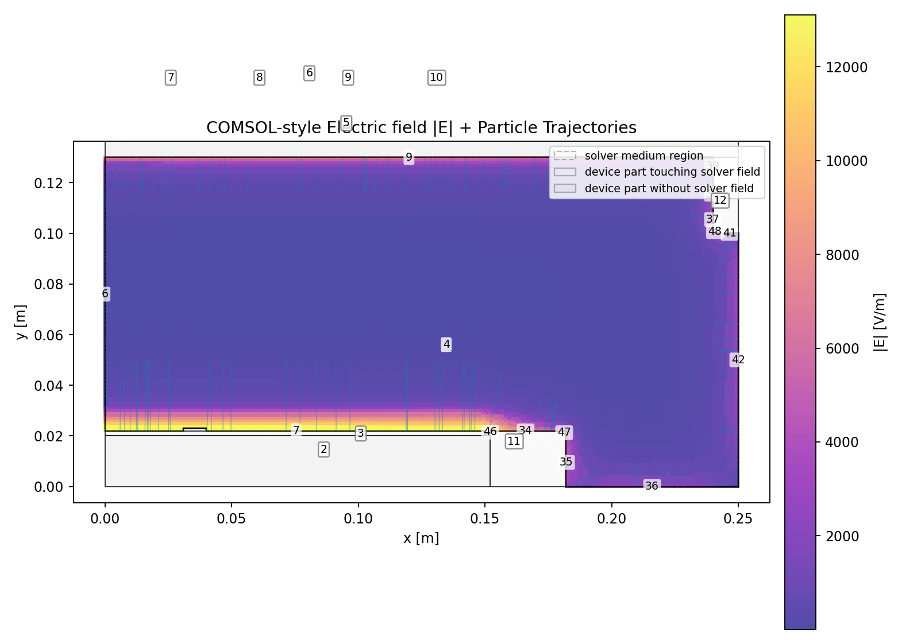

# ICP表面起源粒子の妥当性確認

この文書は、ICPチャンバー内で表面起源粒子を追跡する計算について、入力条件、境界処理、力場、drag、wall law が設定どおりに働いているかを確認するための検証レポートです。ここで扱うのは、破損やデポ剥離によって粒子が発生する過程ではなく、既に与えられた粒子が流体場・電場・壁条件のもとでどのように運動するかという軌道計算です。

## 要約

- 検証スイートの acceptance criteria はすべて `true` です。
- 全ケースで、表面上に置いた300個の粒子に `source.preprocess.boundary_release` が適用され、offset失敗は `0` でした。
- C0からC5まで、`hard_invalid=0`, `invalid_mask_stopped=0`, `unresolved_crossing=0` です。表面releaseや境界判定が原因で計算が止まる挙動は見られません。
- C2とC4の比較で電場ON/OFFの差、C2とC3の比較で電荷符号の差、C6でwall lawの差が明確に出ています。
- 10 nm粒子のICP内飛散として物理的に主に参照すべき代表ケースは、負電荷、Epstein drag、電場ONのC3系です。正電荷ケースは、力の符号と壁応答が実装どおり反映されるかを見るための対照ケースです。

## この計算が扱う範囲

本コードは、与えられた粒子初期条件と場から粒子軌道を計算します。ユーザーが粒径、密度、電荷、初期位置、初期速度、流速場、電場、壁条件を与えると、その条件のもとで粒子の位置、速度、壁接触、終端状態を時間積分します。

この検証で使った場は、ICPのCOMSOLエクスポートをもとにした2D幾何、流速、電場、ガス場です。粒子は部品表面上の座標から開始します。表面座標はそのまま補間に渡すと、数値的には境界上または境界外と判定されることがあるため、`boundary_release` によって計算領域側へ最小限だけ正規化します。この処理は剥離モデルでも発生モデルでもなく、表面から出た粒子を軌道計算の初期値として置くための幾何的な正規化です。

今回の代表粒子は、直径 `10 nm`、密度 `2200 kg/m3` です。電荷 `±20e` の場合、`q/m` は約 `±2.78e3 C/kg` です。これは10 nm粒子では電気力が運動を支配し得るスケールであり、C2/C3の大きな差はこの条件と整合します。

## 検証設計

複雑なICPケースを一つだけ見ると、初期速度、電場、drag、壁条件のどれが結果を支配したのか判断しにくくなります。そのため、ここではC0からC6までの小さな対照ケースに分けています。すべて同じ表面起源の粒子集合から始め、ユーザー指定の物理的な事前offsetは `0 m` にしています。

| Case | 主な確認点 | 変える条件 |
|---|---|---|
| C0 | 表面releaseと初期field support | 中立、低初速、電場OFF |
| C1 | 初速だけで飛散できるか | 中立、20 m/s、電場OFF |
| C2 | 正電荷で電場が働くか | `+20e`, 電場ON |
| C3 | 電荷符号の反転が軌道に出るか | `-20e`, 電場ON |
| C4 | C2の差が電場由来か | `+20e`, 電場OFF |
| C5 | 電場ON時のdragモデル感度 | C3をStokes-Cunninghamへ変更 |
| C5b | drag単独の対照 | 中立、Stokes-Cunningham、電場OFF |
| C6 | wall lawが終端状態に反映されるか | C2のwall lawをstickへ変更 |

検証の基本方針は、結果の絶対値を実験値として主張することではありません。まず、設定した力と境界条件が計算結果に分離可能な形で現れるかを確認します。そのうえで、実運用では電荷、放出速度、sheath近傍の場、壁付着条件を測定値または別解析に合わせて校正します。

## 数値経路と診断

| 段階 | 入力/設定 | 主に見る診断 |
|---|---|---|
| 初期条件 | `particles.csv`, source law, release位置 | `source_particle_diagnostics.csv`, `input_contract_report.json` |
| 表面release | `source.preprocess.boundary_release=true` | `boundary_release_applied_count`, `boundary_release_failed_offset_count` |
| 力場 | `solver.forces`, `charge`, `E_x/E_y` | `force_contributions.csv`, `electric_q_over_m_particle_stats` |
| drag | `solver.drag_model` | `solver_report.json`, drag/gas property plots |
| 壁相互作用 | `part_walls.csv` の wall law | `wall_events.csv`, `wall_summary.json`, final states |
| 軌道出力 | save frames, final particles | `positions_2d.npy`, graphs, GIF animations |

`mixed_stencil` は境界近傍補間の診断です。C2やC6では壁近傍で多数の反射または接触が起きるため、mixed stencilのカウントは増えます。一方で `hard_invalid=0`、`invalid_mask_stopped=0`、`unresolved_crossing=0` であるため、この検証では「境界近傍を通った」という診断であり、計算破綻や停止を意味していません。

## 主要結果

| Case | Forces | Drag | Charge [e] | Source speed [m/s] | Net median [mm] | Path median [mm] | Wall events | Final state | Invalid/Hard |
|---|---|---|---:|---:|---:|---:|---:|---|---:|
| C0 | drag | epstein | 0 | 2.0 | 0.0974 | 0.0974 | 0 | active_free_flight=300 | 0/0 |
| C1 | drag | epstein | 0 | 20.0 | 0.972 | 0.972 | 1 | active_free_flight=300 | 0/0 |
| C2 | drag,electric | epstein | 20 | 20.0 | 0.0816 | 0.507 | 4102 | active_free_flight=300 | 0/0 |
| C3 | drag,electric | epstein | -20 | 20.0 | 11.8 | 11.8 | 1 | active_free_flight=300 | 0/0 |
| C4 | drag | epstein | 20 | 20.0 | 0.972 | 0.972 | 1 | active_free_flight=300 | 0/0 |
| C5 | drag,electric | stokes_cunningham | -20 | 20.0 | 11.6 | 11.6 | 1 | active_free_flight=300 | 0/0 |
| C5b | drag | stokes_cunningham | 0 | 20.0 | 0.955 | 0.955 | 1 | active_free_flight=300 | 0/0 |
| C6 | drag,electric | epstein | 20 | 20.0 | 0.0041 | 0.0299 | 267 | active_free_flight=33, stuck=267 | 0/0 |

元データ: [assets/icp_validation/icp_validation_suite_metrics.csv](assets/icp_validation/icp_validation_suite_metrics.csv) / [assets/icp_validation/icp_validation_suite_evaluation.json](assets/icp_validation/icp_validation_suite_evaluation.json)

## 図の読み方

### 全ケース比較

C0とC1は、電場なしで初速を変えた基準です。source speedを `2 m/s` から `20 m/s` に上げると、net/path displacementは約10倍になります。これは、初期速度が軌道へ直接反映されていることを示します。

C2はpath lengthがnet displacementより大きく、wall eventsも多いケースです。これは、粒子が長く動いていないという意味ではなく、正電荷が電場で壁側へ戻され、specular wall lawにより反射を繰り返したためです。C3は負電荷で、同じ電場でも大きく飛散し、壁イベントはほぼ発生しません。

### 電場と電荷符号

C2とC4は、正電荷、初速、dragを同じにし、電場だけを変えた対照です。電場OFFのC4ではwall eventsは `1`、電場ONのC2では `4102` です。したがって、C2の多数反射は表面releaseや初期速度の副作用ではなく、電気力によるものです。

C2とC3は、電場ON、Epstein drag、初速を同じにし、電荷符号だけを変えています。正電荷では壁近傍に戻り、負電荷では大きく飛散します。これは `qE/m` の符号が軌道に反映されていることを示します。

### dragモデル感度

C3とC5は、電場ONかつ負電荷の条件でEpsteinとStokes-Cunninghamを比較しています。この条件では電気力が強く、dragモデル差は相対的に小さく見えます。そこでC1とC5bの中立・電場OFF条件をあわせて見ます。電場を外した状態でもEpsteinとStokes-Cunninghamの差は小さく、今回の粒径・時間・場ではdragモデル選択より初速と電気力の寄与が大きいことが分かります。

これは「dragモデルが不要」という意味ではありません。低圧・微小粒子ではEpstein系の扱いが自然ですが、今回の検証ではdragモデルを変えても境界処理や時間積分が破綻しないこと、また電場支配条件ではdrag差が見えにくいことを確認しています。

### wall law

C2はspecular反射なので、壁に当たっても粒子はactive free flightとして残ります。C6は同じ粒子条件と同じ電場でwall lawをstickに変更しています。結果として267個がstuckになり、壁到達が終端状態へ反映されました。

この比較は、壁に到達した粒子を反射粒子として扱うのか、再付着または捕捉として扱うのかを、wall law設定で切り替えられることを示します。実際の付着率や再飛散率は、材料、表面粗さ、温度、プラズマ条件に依存するため、ここでは数値経路の確認に限定します。

## ケース別評価

### C0: 表面releaseのみの基準

表面上の粒子300個が全て計算領域側へ正規化され、offset失敗はありません。`hard_invalid=0`、`invalid_mask_stopped=0` なので、境界上初期位置を通常runの初期条件として扱う経路は機能しています。

- setup: forces=`drag`, drag=`epstein`, charge=`0e`, source speed mean=`2.0 m/s`
- boundary: applied=`300/300`, failed offset=`0`, user source offset median=`0 um`, solver offset median=`2 um`
- result: net median=`0.0974 mm`, path median=`0.0974 mm`, wall events=`0`, final state=`active_free_flight=300`

### C1: 初速による飛散

電場なし・中立粒子で初速だけを `20 m/s` に上げると、median displacementは約 `0.972 mm` になります。C0との比較から、初速が軌道へ反映されていること、また電場なしでも粒子が飛散できることが確認できます。

- setup: forces=`drag`, drag=`epstein`, charge=`0e`, source speed mean=`20.0 m/s`
- boundary: applied=`300/300`, failed offset=`0`, user source offset median=`0 um`, solver offset median=`2 um`
- result: net median=`0.972 mm`, path median=`0.972 mm`, wall events=`1`, final state=`active_free_flight=300`

### C2: 正電荷と電場

正電荷 `+20e` を持つ粒子で電場を有効にしたケースです。wall eventsが `4102` と多く、net displacementは小さい一方でpath lengthは大きくなります。これは、粒子が動いていないのではなく、壁近傍へ戻されて反射を繰り返す挙動です。

低温ICP中の微粒子は負帯電を代表条件とすることが多いため、C2は物理代表というより符号検証です。電場の向きと電荷符号が計算に入っているか、壁反射がイベントとして記録されるかを見るためのケースです。

- setup: forces=`drag,electric`, drag=`epstein`, charge=`20e`, source speed mean=`20.0 m/s`
- boundary: applied=`300/300`, failed offset=`0`, user source offset median=`0 um`, solver offset median=`2 um`
- result: net median=`0.0816 mm`, path median=`0.507 mm`, wall events=`4102`, final state=`active_free_flight=300`

### C3: 負電荷と電場

負電荷 `-20e` で電場を有効にしたケースです。net medianは `11.8 mm`、wall eventは `1` 件です。C2と電荷符号だけを変えたときに軌道が大きく変わるため、`qE/m` の符号と大きさが軌道へ反映されていると判断できます。

この検証スイートの中では、10 nmの表面起源粒子がICP電場で飛散する代表ケースとしてC3を主に参照します。

- setup: forces=`drag,electric`, drag=`epstein`, charge=`-20e`, source speed mean=`20.0 m/s`
- boundary: applied=`300/300`, failed offset=`0`, user source offset median=`0 um`, solver offset median=`2 um`
- result: net median=`11.8 mm`, path median=`11.8 mm`, wall events=`1`, final state=`active_free_flight=300`

### C4: 電場OFF対照

C2と同じ正電荷・初速で電場だけをOFFにしています。結果はC1とほぼ同じで、wall eventsは `1` に戻ります。C2の多数反射が、電場由来であることを切り分ける対照です。

- setup: forces=`drag`, drag=`epstein`, charge=`20e`, source speed mean=`20.0 m/s`
- boundary: applied=`300/300`, failed offset=`0`, user source offset median=`0 um`, solver offset median=`2 um`
- result: net median=`0.972 mm`, path median=`0.972 mm`, wall events=`1`, final state=`active_free_flight=300`

### C5: 負電荷でdragモデルを変更

C3と同じ負電荷・電場ONでdragをStokes-Cunninghamに変更しています。median displacementはC3と近く、この条件では電場支配が強いことが分かります。dragモデルを変更しても不正停止や境界破綻は発生していません。

- setup: forces=`drag,electric`, drag=`stokes_cunningham`, charge=`-20e`, source speed mean=`20.0 m/s`
- boundary: applied=`300/300`, failed offset=`0`, user source offset median=`0 um`, solver offset median=`2 um`
- result: net median=`11.6 mm`, path median=`11.6 mm`, wall events=`1`, final state=`active_free_flight=300`

### C5b: 中立粒子でdrag単独対照

中立・電場OFFでStokes-Cunninghamを使う対照です。C1と比較することで、電場に隠れないdrag差を確認します。今回の条件ではC1との差は小さく、短時間の初速支配が強い設定になっています。

- setup: forces=`drag`, drag=`stokes_cunningham`, charge=`0e`, source speed mean=`20.0 m/s`
- boundary: applied=`300/300`, failed offset=`0`, user source offset median=`0 um`, solver offset median=`2 um`
- result: net median=`0.955 mm`, path median=`0.955 mm`, wall events=`1`, final state=`active_free_flight=300`

### C6: stick wall law

C2と同じ正電荷・電場条件で、wall lawをstickに変更しています。267個がstuckとなり、壁到達が終端状態として記録されます。C2のspecular反射と比較すると、wall lawが終端状態へ正しく反映されていることが分かります。

- setup: forces=`drag,electric`, drag=`epstein`, charge=`20e`, source speed mean=`20.0 m/s`
- boundary: applied=`300/300`, failed offset=`0`, user source offset median=`0 um`, solver offset median=`2 um`
- result: net median=`0.0041 mm`, path median=`0.0299 mm`, wall events=`267`, final state=`active_free_flight=33, stuck=267`

## 代表ケースの図とアニメーション

### C2: Positive charge with electric field

- Animation: [C2 trajectories_all_particles.gif](assets/icp_validation/cases/C2/trajectories_all_particles.gif)
- Sampled trail animation: [C2 trajectories_sampled_trails.gif](assets/icp_validation/cases/C2/trajectories_sampled_trails.gif)

### C3: Negative charge with electric field

- Animation: [C3 trajectories_all_particles.gif](assets/icp_validation/cases/C3/trajectories_all_particles.gif)
- Sampled trail animation: [C3 trajectories_sampled_trails.gif](assets/icp_validation/cases/C3/trajectories_sampled_trails.gif)

### C6: Wall-law sensitivity: stick

- Animation: [C6 trajectories_all_particles.gif](assets/icp_validation/cases/C6/trajectories_all_particles.gif)
- Sampled trail animation: [C6 trajectories_sampled_trails.gif](assets/icp_validation/cases/C6/trajectories_sampled_trails.gif)

## 判定

この検証スイートでは、表面上に置いた粒子を初期値として扱い、境界近傍で数値的に破綻せず、電荷符号、電場ON/OFF、dragモデル、wall lawの違いを結果として分離できます。特にC2/C4、C2/C3、C2/C6の比較により、電場、電荷符号、壁条件の影響がそれぞれ別の対照で確認されています。

一方で、この結果はチャンバーコンタミ量や再付着率を直接予測するものではありません。発生確率、剥離条件、粒子電荷分布、sheath近傍の詳細電場、ion drag、動的帯電、表面粗さや付着力は、別途モデル化または入力場として与える必要があります。本検証の意義は、そうした入力を与えたときに、軌道計算器としての基本経路が設定どおりに動くことを確認した点にあります。

## 注意点

- solver offset medianの `2 um` は、表面座標を計算領域側へ置くための数値的な境界正規化量です。粒子の物理的な剥離距離を意味しません。sheath直近や強い近壁勾配を議論する場合は、`wall.epsilon_offset_m`、境界許容値、メッシュ解像度に対する感度確認が必要です。
- 正電荷ケースは符号検証用です。通常の低温ICP dust代表としては、負帯電ケースを基準に見ます。
- stick wall lawの結果は、壁到達を終端状態へ変換できることの確認です。実材料の付着率や再飛散率を示すものではありません。
- これはCOMSOL faithful比較ではなく、COMSOL由来場を通常runへ入力した場合の軌道計算検証です。
